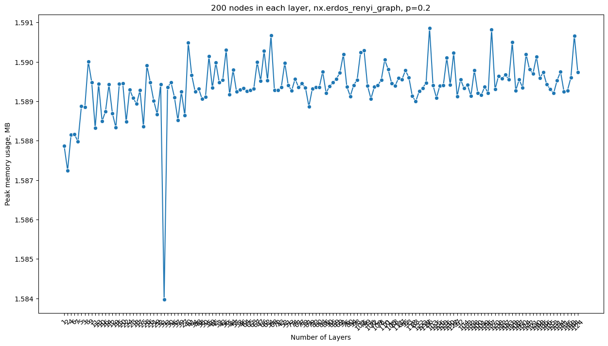

# Community detection code profiling


<!-- WARNING: THIS FILE WAS AUTOGENERATED! DO NOT EDIT! -->

Notebook generates synthetic datasets of different configurations
(different number of layers and elements per layer) and explores the
performance of code (execution time and memory consumption) for each of
selected configurations. Initial version relies on MolTi implementation
for the communities detection problem, but pipeline can be adapted to
benchmarking of different [communities detection
algorithms](https://link.springer.com/article/10.1007/s10618-020-00716-6)
like [InfoMap](https://github.com/mapequation/infomap).

## 0. Import dependencies

``` python
# add parent directory to path so we can import utils
import sys
import os
import shutil
sys.path.append('../')
import time
import pandas as pd
import matplotlib
import matplotlib.pyplot as plt
import seaborn as sns
```

``` python
from pathlib import Path
import numpy as np
from BioMultiNet.utils import *
from BioMultiNet.cmmd import *
import networkx as nx
from tqdm.notebook import tqdm
```

``` python
path_to_benchmark = Path("../data/benchmark/")
path_to_benchmark.mkdir(exist_ok=True)
```

## 1. Generate synthetic datasets

### 1.1 Scenario 1

Increase number of layers, all layers have the same number of nodes in
them (`200`).

``` python
n_layers = np.arange(1, 101, 1)
n = 200
p = 0.2
```

``` python
path_to = path_to_benchmark / "scenario-1"
path_to.mkdir(exist_ok=True)
```

``` python
obfuscate = True
label_edges = ""

for n_layer in tqdm(n_layers):
    # create directory for the dataset with current number of layers
    path_to = path_to_benchmark / f"scenario-1/{n_layer}"
    path_to.mkdir(exist_ok=True)

    # populate created directory with synthetic layers
    node_labels_pool = []
    for n_layer_idx in range(n_layer):
        G = create_and_save_random_graph(generator=nx.erdos_renyi_graph,
                                        label_edges=label_edges,
                                        path_to=path_to / f"{n_layer_idx}.csv",
                                        n=n,
                                        p=p,
                                        directed=False,
                                        obfuscate=obfuscate,
                                        node_labels_pool=node_labels_pool)
        node_labels_pool.extend(list(G.nodes()))
```

      0%|          | 0/100 [00:00<?, ?it/s]

## 2. Benchmarking

For the selected scenario let’s compute community detection problem, log
consumed resources and viaualize them.

``` python
d = {}

prefix_ = path_to_benchmark / "scenario-1"

for k in tqdm(os.listdir(prefix_)):
    # select the folder with the mentioned number of layers
    prefix = str(prefix_) + "/" + k
    # list of the filenames - input layers
    input_layers = [prefix + "/" + x for x in os.listdir(prefix) if x.endswith(".csv")]

    for l in input_layers:
        assert Path(l).exists()

    start = time.time()
    cmmd_output = cmmd(nodelist = None,
        input_layers = input_layers,
        gamma_min = 0,
        gamma_max = 30,
        gamma_step = 0.5,
        path_to_communities = "../out/communities/",
        distmethod = "hamming",
        n_jobs = 6)
    
    duration = time.time() - start

    # clean up
    shutil.rmtree("../out/communities/")

    d[k] = duration

print(d)
```

      0%|          | 0/100 [00:00<?, ?it/s]

    {'31': 6.770324945449829, '75': 14.484583854675293, '42': 8.959571838378906, '15': 3.7124531269073486, '71': 13.9744873046875, '3': 1.1011457443237305, '78': 15.205758571624756, '24': 5.371524095535278, '84': 16.141170501708984, '100': 19.349994897842407, '72': 14.28057074546814, '85': 16.635345220565796, '59': 11.813063621520996, '12': 3.14388370513916, '88': 17.228288412094116, '90': 17.65051031112671, '66': 13.965642213821411, '8': 2.285508394241333, '17': 4.0732581615448, '4': 1.3713326454162598, '38': 8.058760643005371, '20': 4.781110763549805, '93': 18.834080934524536, '18': 4.254984140396118, '21': 4.830830335617065, '5': 1.65264892578125, '70': 13.980457305908203, '65': 12.718465566635132, '73': 14.824580669403076, '22': 5.000579357147217, '9': 2.51029634475708, '6': 1.818345546722412, '53': 11.076967477798462, '2': 0.8684158325195312, '91': 17.708168745040894, '98': 18.87727403640747, '55': 11.234635591506958, '50': 10.009679794311523, '49': 10.039834260940552, '94': 18.309519290924072, '33': 7.08008074760437, '99': 19.352848052978516, '76': 15.50121808052063, '54': 10.795984029769897, '60': 11.950036764144897, '69': 13.361162662506104, '68': 13.784982204437256, '89': 17.226262092590332, '26': 5.859835386276245, '23': 5.183246850967407, '77': 15.258048057556152, '44': 9.00645661354065, '61': 12.308953523635864, '37': 8.04716944694519, '7': 1.9662771224975586, '28': 5.9620726108551025, '32': 6.768187761306763, '39': 8.059011697769165, '25': 5.441216945648193, '56': 11.154169797897339, '64': 12.184103012084961, '74': 14.449753284454346, '29': 6.344885587692261, '82': 16.61689043045044, '11': 2.9028053283691406, '16': 3.9098587036132812, '48': 9.772667646408081, '80': 15.921027898788452, '95': 18.184608221054077, '81': 15.95603346824646, '62': 12.219666004180908, '86': 16.82018208503723, '35': 7.4861719608306885, '51': 10.61707329750061, '57': 11.506405115127563, '83': 16.195647716522217, '43': 9.08676028251648, '41': 8.651748895645142, '40': 8.447950601577759, '36': 7.587794303894043, '63': 12.859253168106079, '19': 4.550904273986816, '67': 13.500339031219482, '79': 15.75006628036499, '58': 11.457986116409302, '13': 2.803053379058838, '1': 0.5027480125427246, '14': 3.0981554985046387, '87': 15.07165265083313, '10': 2.4170913696289062, '46': 8.43606424331665, '27': 5.302222013473511, '47': 8.52686333656311, '96': 16.940941333770752, '52': 9.4132080078125, '30': 5.892106771469116, '45': 8.464815378189087, '92': 16.185070991516113, '97': 17.319541692733765, '34': 6.687211036682129}

``` python
# sort the dictionary
sorted_d = dict(sorted(d.items(), key=lambda item: item[1]))
```

``` python
# create a dataframe from the dictionary
df = pd.DataFrame.from_dict(sorted_d, orient='index')
df = df.reset_index()
df = df.rename(columns={'index': 'n_layers', 0: 'duration'})
df.head()
```

<div>
<style scoped>
    .dataframe tbody tr th:only-of-type {
        vertical-align: middle;
    }
&#10;    .dataframe tbody tr th {
        vertical-align: top;
    }
&#10;    .dataframe thead th {
        text-align: right;
    }
</style>

<table class="dataframe" data-quarto-postprocess="true" data-border="1">
<thead>
<tr class="header" style="text-align: right;">
<th data-quarto-table-cell-role="th"></th>
<th data-quarto-table-cell-role="th">n_layers</th>
<th data-quarto-table-cell-role="th">duration</th>
</tr>
</thead>
<tbody>
<tr class="odd">
<td data-quarto-table-cell-role="th">0</td>
<td>1</td>
<td>0.502748</td>
</tr>
<tr class="even">
<td data-quarto-table-cell-role="th">1</td>
<td>2</td>
<td>0.868416</td>
</tr>
<tr class="odd">
<td data-quarto-table-cell-role="th">2</td>
<td>3</td>
<td>1.101146</td>
</tr>
<tr class="even">
<td data-quarto-table-cell-role="th">3</td>
<td>4</td>
<td>1.371333</td>
</tr>
<tr class="odd">
<td data-quarto-table-cell-role="th">4</td>
<td>5</td>
<td>1.652649</td>
</tr>
</tbody>
</table>

</div>

``` python
# save the dataframe to csv
df.to_csv("../out/duration.csv", index=False)
```

``` python
width = 15
height = 8
matplotlib.rcParams['figure.figsize'] = [width, height]
```

``` python
# Create the plot (using a line plot as an example)
sns.lineplot(x='n_layers', y='duration', data=df, marker='o')

# Rotate the x-axis labels for a compact look
plt.xticks(rotation=45)  # Rotate by 45 degrees

# Add labels and title
plt.xlabel('Number of Layers')
plt.ylabel('Execution time, s')
plt.title('Execution time vs Number of Layers')

# Display the plot
plt.show()
```


