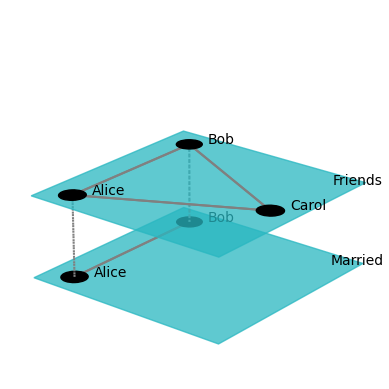
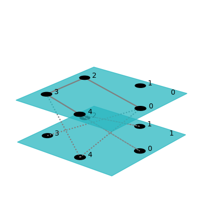
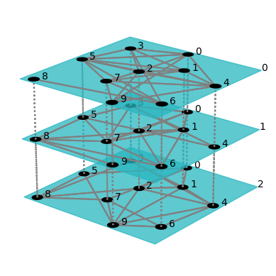
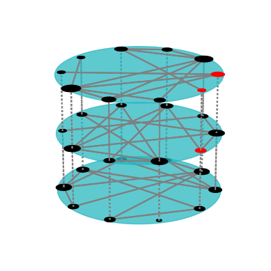
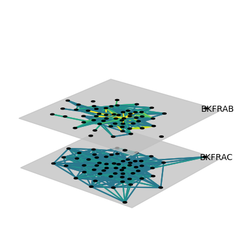
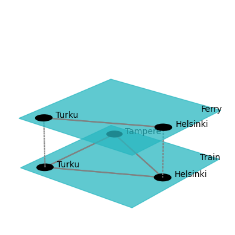
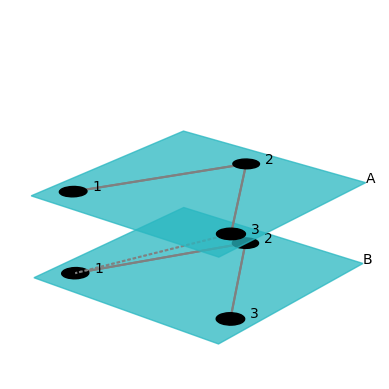

# Exploration of `pymnet` capabilities


<!-- WARNING: THIS FILE WAS AUTOGENERATED! DO NOT EDIT! -->

## 1. Overview

Additional text can be added here and it will be reflected in the
documentation.

``` python
from pymnet import *

net_social = MultiplexNetwork(couplings="categorical", fullyInterconnected=False)
net_social["Alice", "Bob", "Friends"] = 1
net_social["Alice", "Carol", "Friends"] = 1
net_social["Bob", "Carol", "Friends"] = 1
net_social["Alice", "Bob", "Married"] = 1

fig_social = draw(net_social, layout="circular", layerPadding=0.2, defaultLayerLabelLoc=(0.9,0.9))
```



Time required to generate different networks:

``` python
import pymnet
net = pymnet.er(10, 10**5*[0.1])
```

``` python
net = pymnet.er(10**5,10*[10**-5])
```

## 2. Network types

### Monoplex networks

Monoplex networks have aspect value equals to `0`.

``` python
net = pymnet.MultilayerNetwork(aspects=0)
```

``` python
net.add_node(1)
net.add_node(2)
```

``` python
list(net)
```

    [1, 2]

``` python
net[1].deg()
```

    0

Add edge:

``` python
net[1, 2] = 1
```

``` python
net[1, 3] = 1
list(net)
```

    [1, 2, 3]

``` python
net[1, 2], net[2, 1], net[1, 1]
```

    (1, 1, 0)

``` python
list(net[1])
```

    [2, 3]

``` python
net[1, 3] = 0
list(net[1])
```

    [2]

``` python
net[1, 3] = 2
net[1].deg()
```

    2

``` python
list(net[1])
```

    [2, 3]

``` python
net[1].strength()
```

    3

``` python
dirnet = pymnet.MultilayerNetwork(aspects=0, directed=True)

dirnet[1, 2] = 1
```

``` python
dirnet[1, 2], dirnet[2, 1]
```

    (1, 0)

``` python
net[2, 1]
```

    1

### Multilayer networks

``` python
mnet = pymnet.MultilayerNetwork(aspects=1)
```

``` python
mnet.add_node(1)
mnet.add_layer("a")
```

``` python
mnet[1, "a"].deg()
```

    0

``` python
mnet[1, 2, "a", "b"] = 1
```

``` python
mnet[1, "a"][2, "b"] = 1
```

``` python
list(mnet[1, "a"])
```

    [(2, 'b')]

``` python
list(mnet[1, "b"])
```

    []

``` python
list(mnet)
```

    [1, 2]

Examples of the multilayer net with several aspects:

``` python
mnet2 = pymnet.MultilayerNetwork(aspects=2)
mnet2[1, 2, "a" ,"b", "x" ,"y"] = 1
mnet2[1, "a", "x"][2, "b", "y"]
```

    1

``` python
list(mnet2)
```

    [1, 2]

``` python
list(mnet2[1, "a", "x"])
```

    [(2, 'b', 'y')]

``` python
mnet2.get_layers()
```

    {'a', 'b'}

``` python
mnet2.add_layer("c", 1)
mnet2.add_layer("z", 2)
```

``` python
mnet2.get_layers()
```

    {'a', 'b', 'c'}

### Multiplex networks

``` python
mplex = pymnet.MultiplexNetwork(couplings="none")
```

``` python
mplex[1, "a"][2, "a"] = 1
```

Can access the intra-layer networks as follows:

``` python
mplex.A["a"][1, 2]
```

    1

``` python
mplex.A["a"][1, 3] = 1
```

``` python
cnet = pymnet.MultiplexNetwork(couplings="categorical")
cnet.add_node(1)
cnet.add_layer("a")
cnet.add_layer("b")
cnet[1, 1, "a", "b"]
```

    1.0

``` python
onet = pymnet.MultiplexNetwork(couplings="ordinal")
onet.add_node("node")
onet.add_layer(1)
onet.add_layer(2)
onet.add_layer(3)
onet["node", "node", 1, 2]
```

    1.0

``` python
onet["node", "node", 1, 3]
```

    0

``` python
cnet = pymnet.MultiplexNetwork(couplings=("categorical", 10))
cnet.add_node(1)
cnet.add_layer("a")
cnet.add_layer("b")
cnet[1, 1, "a", "b"]
```

    10

``` python
conet = pymnet.MultiplexNetwork(couplings=["categorical", "ordinal"])
conet.add_node("node")
conet.add_layer("a", 1)
conet.add_layer("b", 1)
conet.add_layer(1, 2)
conet.add_layer(2, 2)
conet.add_layer(3, 2)
conet["node", "node", "a", "a", 1, 2]
```

    1.0

``` python
conet.A[("a", 1)]["node", "node2"] = 1
```

## 3. Visualization of networks

``` python
import random
random.seed(42)
import numpy as np
np.random.seed(42)
```

``` python
from pymnet import *
net = models.er_multilayer(5, 2, 0.2)
fig = draw(net, layout="circular", layerPadding=0.2, defaultLayerLabelLoc=(0.9,0.9))
```



``` python
fig.savefig("er_multilayer.png")
```

``` python
fig = draw(er(10, 3*[0.5]), layout="spring")
```



``` python
fig = draw(er(10, 3*[0.3]),
           layout="circular",
           layershape="circle",
           nodeColorDict={(0,0):"r", (1,0):"r", (0,1):"r"},
           layerLabelRule={},
           nodeLabelRule={},
           nodeSizeRule={"rule":"degree", "propscale":0.05}
           )
```



``` python
import requests
dataset = "bkfrat.dat"
fraternity_dataset_url = f"http://vlado.fmf.uni-lj.si/pub/networks/data/ucinet/{dataset}"
res = requests.get(fraternity_dataset_url)
with open(dataset, "wb") as f:
    f.write(res.content)
```

``` python
net = read_ucinet(dataset, couplings="none")
net = transforms.threshold(net, 4)
fig = draw(net,
           layout="spring",
           layerColorRule={},
           defaultLayerColor="silver",
           nodeLabelRule={},
           edgeColorRule={"rule":"edgeweight", "colormap":"viridis", "scaleby":0.1},
           defaultLayerLabelLoc=(0.9,0.9)
           )
```



## 4. Isomorphysms and automorphisms

### Setup

``` python
from pymnet import *
net_social = MultiplexNetwork(couplings="categorical", fullyInterconnected=False)
net_social["Alice", "Bob", "Friends"] = 1
net_social["Alice", "Carol", "Friends"] = 1
net_social["Bob", "Carol", "Friends"] = 1
net_social["Alice", "Bob", "Married"] = 1
# net_social["John", "Bob", "Bussiness"] = 1
fig_social = draw(net_social, layout="circular", layerPadding=0.2, defaultLayerLabelLoc=(0.9,0.9))
```


``` python
net_transport = MultiplexNetwork(couplings="categorical", fullyInterconnected=False)
net_transport["Helsinki", "Turku", "Train"] = 1
net_transport["Helsinki", "Tampere", "Train"] = 1
net_transport["Turku", "Tampere", "Train"] = 1
net_transport["Helsinki", "Turku", "Ferry"] = 1
fig_transport = draw(net_transport, layout="circular", layerPadding=0.2, defaultLayerLabelLoc=(0.9,0.9))
```



### Isomorphisms

``` python
# node isomorphism
is_isomorphic(net_social, net_transport, allowed_aspects=[0])
```

    False

``` python
# layer isomorphism
is_isomorphic(net_transport, net_social, allowed_aspects=[1])
```

    False

``` python
# node-layer isomorphism
is_isomorphic(net_transport, net_social, allowed_aspects=[0, 1])
```

    True

``` python
get_isomorphism(net_transport, net_social)
```

    [{'Helsinki': 'Bob', 'Tampere': 'Carol', 'Turku': 'Alice'},
     {'Ferry': 'Married', 'Train': 'Friends'}]

``` python
net_social_complete_invariant = get_complete_invariant(net_social)
net_transport_complete_invariant = get_complete_invariant(net_transport)
print(net_social_complete_invariant, net_transport_complete_invariant)
```

    ((((), 0),), <bliss_bind.NamedGraph object>) ((((), 0),), <bliss_bind.NamedGraph object>)

### Automorphisms

``` python
# node isomorphism
get_automorphism_generators(net_social, allowed_aspects=[0])
```

    [[{'Bob': 'Alice', 'Alice': 'Bob'}, {}]]

``` python
# layer isomorphism
get_automorphism_generators(net_social, allowed_aspects=[1])
```

    []

``` python
# node-layer isomorphism
get_automorphism_generators(net_social, allowed_aspects=[0, 1])
```

    [[{'Bob': 'Alice', 'Alice': 'Bob'}, {}]]

``` python
net = MultilayerNetwork(aspects=1)
net[1, "A"][2, "A"] = 1
net[2, "A"][3, "A"] = 1
net[3, "B"][2, "B"] = 1
net[2, "B"][1, "B"] = 1
net[3, "A"][1, "B"] = 1
fig = draw(net, layerPadding=0.2)
```



``` python
get_automorphism_generators(net, allowed_aspects=[0])
```

    []

``` python
get_automorphism_generators(net, allowed_aspects=[1])
```

    []

``` python
get_automorphism_generators(net, allowed_aspects=[0, 1])
```

    [[{1: 3, 3: 1}, {'A': 'B', 'B': 'A'}]]

## 5. Using NetworkX functions

``` python
from pymnet import nx
```

``` python
net = nx.karate_club_graph()
```

``` python
type(net)
```

    pymnet.net.MultilayerNetwork

``` python
net.aspects
```

    0

``` python
import random
random.seed(42)
```

``` python
import pymnet
{name: nx.number_connected_components(layer) for name, layer in pymnet.er(1000, 3*[0.005]).A.items()}
```

    {0: 10, 1: 9, 2: 5}
